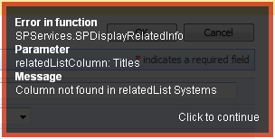

## Certification

This icon indicates that the function is Certified for SharePoint 2007. There have been no reported issues, and the function works well in all of my testing.  

This icon indicates that the function has not yet been tested with SharePoint 2010. If you see this icon for a function, it doesn&rsquo;t necessarily mean that the function won&rsquo;t work with SharePoint 2010, it means that I can't say either way because I haven&rsquo;t done any testing. If you try the function, please let me know what happens, whether positive or negative.

This icon indicates that the function has been tested and works with SharePoint 2010 but that there are some caveats. In each case where you see this icon, you&rsquo;ll also see explicit details of what you need to consider or watch for to use the function with SharePoint 2010.  

This icon indicates that the function is Certified for SharePoint 2010. This means that, to the best of my knowledge, and based on my testing, the function works fine with SharePoint 2010. As with SharePoint 2007, your mileage may well vary, depending on what types of customization you have done.

Thanks to <a href="http://htdweb.com/">Michael Greene</a> for his great work on these icons and the project logo.

## Debug Mode
One of the goals of the implementations in this library is to "do no harm". By this, I mean that no inherent functionality should be lost due to a problem. All of the functions in the library are meant to "run silent", meaning that no messages or alerts are presented to the user if something goes wrong. At this stage, there are some exceptions to this, but it is the goal.

In the functions which have it implemented, setting `debug: true` indicates that you would like to receive messages if anything obvious is wrong with the function call, like specifying a column name which doesn't exist. By using debug mode, you can receive messages to help you get things set up; I recommend turning debug mode off once everything is in place and running correctly. Debug mode was first implemented in <a href="http://spservices.codeplex.com/Release/ProjectReleases.aspx?ReleaseId=35706"> v0.4.5</a>, and the functionality will be expanded over time.

When debug mode is enabled, you will receive messages like this if there is an issue:

## DisplayName
DisplayName (as opposed to [StaticName](#staticname)) means the name of the column which is shown on forms and as the header in list views, e.g., `Region Name`. The StaticName would be `Region_x0020_Name`, i.e., the underlying column name.

## minified
From Wikipedia: [Minification](http://en.wikipedia.org/wiki/Minify) (very often just minify, and sometimes also minimisation or minimization), in computer programming languages and especially JavaScript, is the process of removing all unnecessary characters from source code, without changing its functionality. These unnecessary characters usually include white space characters, new line characters, comments and sometimes block delimiters; which are used to add readability to the code, but are not required for it to execute.

## StaticName
StaticName (as opposed to [DisplayName](#displayname)) means the underlying column name, e.g., `Region_x0020_Name`. This is also sometimes called the 'InternalName' for the column. The DisplayName would be `Region Name`, i.e., the name of the column which is shown on forms and as the header in list views. Probably the easiest way to determine the StaticName if you don't know it is to go to List Settings and click on the column name link. When you get to the column properties page, check the URL. It will end in something like this:

`/_layouts/FldEdit.aspx?List=%7B37920121%2D19B2%2D4C77%2D92FF%2D8B3E07853114%7D&amp;Field=Potential%5Fx0020%5FValue`

The StaticName is the value for the Field parameter at the end. This is a little tricky because some of the characters are further encoded. Any occurrences of '%5F' need to be replaced with an underscore '_'. Examples:

* `Potential%5Fx0020%5FValue` -> `Potential_x0020_Value`
* `Child%5Fx0020%5FSite%5Fx0020%5FName` -> `Child_x0020_Site_x0020_Name`
